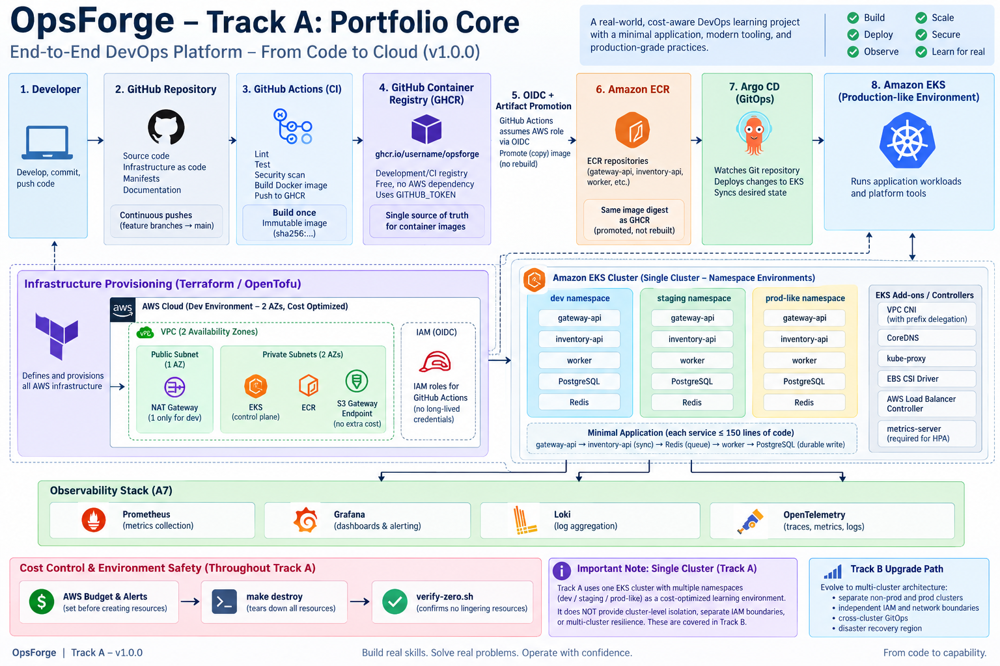

# OpsForge

**Production-Grade Cloud-Native GitOps Platform on AWS EKS**

OpsForge is an end-to-end DevOps, Platform Engineering, and SRE learning project built incrementally from first principles.

The project begins with ordinary host processes and progressively evolves through containerization, CI, Kubernetes, infrastructure as code, AWS EKS, GitOps, observability, performance engineering, security, reliability, and operational evidence.

The goal is not simply to make infrastructure commands succeed.

The goal is to understand what is happening underneath the platform, deliberately expose important failure modes, diagnose them, measure them, document the trade-offs, and preserve the engineering history in Git.

---

## Project Goal

OpsForge is designed to answer one central question:

> How does an application evolve from a few local processes into a reproducible, observable, secure, scalable, cloud-native platform?

The final Track A platform will demonstrate:

- application process fundamentals
- Linux/macOS process and signal behavior
- HTTP and TCP networking
- synchronous and asynchronous service communication
- durable state
- Docker and Docker Compose
- CI pipelines
- immutable container artifacts
- GitHub Container Registry
- AWS ECR
- Kubernetes
- Helm
- Terraform / OpenTofu
- Amazon EKS
- GitHub OIDC authentication to AWS
- Argo CD GitOps
- Prometheus
- Grafana
- Loki
- OpenTelemetry
- autoscaling
- load testing
- baseline DevSecOps controls
- failure recovery
- operational evidence
- cost-aware cloud teardown

---

## Track

Current track:

**Track A — Portfolio Core**

Target release:

**v1.0.0**

Track A builds the stable portfolio platform.

A future **Track B** can extend the same system with advanced capabilities such as:

- multi-cluster architecture
- progressive delivery
- advanced supply-chain security
- policy-as-code
- Karpenter and advanced autoscaling
- SLOs and error budgets
- advanced networking
- eBPF / Cilium
- chaos engineering
- disaster recovery
- internal developer platform capabilities

Track B is designed to extend Track A rather than restart the project.

---

## Learning Method

Every major capability follows:

```text
Learn
  ↓
Build
  ↓
Observe
  ↓
Break
  ↓
Explain
  ↓
Measure
  ↓
Commit
  ↓
Push
```

A phase is not considered complete simply because a command succeeds.

Important engineering claims should be supported by reproducible evidence.

---

## Current Status

### Completed

- ✅ **A0 — Bootstrap, Repository Discipline & Guardrails**
- ✅ **A1 — Minimal Application & Systems Foundations**

### Current Phase

**A2 — Containers & Docker Compose**

A2 will preserve the A1 application behavior while changing the runtime environment from host processes to isolated containers.

The key learning areas will include:

- container images
- image layers
- container filesystems
- PID 1
- signal forwarding
- port publishing
- container networking
- service DNS
- volumes
- non-root execution
- multi-stage builds
- Docker Compose orchestration
- health checks
- container failure diagnosis

---

## Track A Roadmap

| Phase | Focus | Status |
|---|---|---|
| **A0** | Bootstrap, repository discipline, ADRs, evidence, cost guardrails | ✅ Complete |
| **A1** | Minimal application and systems foundations | ✅ Complete |
| **A2** | Containers and Docker Compose | 🚧 Current |
| **A3** | Continuous Integration and GHCR | ⏳ Planned |
| **A4** | Local Kubernetes and Helm | ⏳ Planned |
| **A5** | Terraform, AWS networking, ECR and EKS | ⏳ Planned |
| **A6** | GitOps with Argo CD | ⏳ Planned |
| **A7** | Observability with Prometheus, Grafana, Loki and OpenTelemetry | ⏳ Planned |
| **A8A** | Performance, load testing and HPA | ⏳ Planned |
| **A8B** | Security, failure testing and recovery | ⏳ Planned |
| **A9** | Final evidence, runbooks, release and Track B handoff | ⏳ Planned |

---

## Target Architecture

The diagram below represents the intended end state of **OpsForge Track A v1.0.0**.

It is a target architecture, not a claim that every component has already been implemented.



The primary delivery path will eventually become:

```text
Developer
   ↓
GitHub
   ↓
GitHub Actions
   ↓
GHCR
   ↓
Immutable Artifact Promotion
   ↓
Amazon ECR
   ↓
Argo CD
   ↓
Amazon EKS
```

Infrastructure will be defined using Terraform / OpenTofu.

Observability will be provided through:

```text
Prometheus
Grafana
Loki
OpenTelemetry
```

---

## Current Architecture — A1 Baseline

Before containerization, all application components run directly on the local host.

```text
                              inventory-api
                                :8001
                                   ▲
                                   │ HTTP
                                   │
client ───────────────► gateway-api
                          :8000
                            │
                ┌───────────┴───────────┐
                │                       │
                ▼                       ▼
          PostgreSQL                  Redis
             :5432                    :6379
                ▲                       │
                │                       │ queue
                │                       ▼
                └──────────────────── worker
```

The A1 architecture intentionally exposes three important application paths.

### Synchronous path

```text
client
  ↓
gateway-api
  ↓
inventory-api
  ↓
gateway-api
  ↓
client
```

The client waits for the downstream dependency.

This path allows controlled experiments with:

- latency
- timeout behavior
- connection failure
- HTTP failure propagation

### Durable state path

```text
gateway-api
    ↓
PostgreSQL
```

PostgreSQL owns durable order state.

Gateway process termination does not remove already committed orders.

### Asynchronous path

```text
gateway-api
    ↓
Redis queue
    ↓
worker
    ↓
PostgreSQL
```

The gateway can persist an order, enqueue background work, and return before the worker completes processing.

This demonstrates asynchronous decoupling.

Detailed A1 architecture documentation is available at:

[`docs/architecture/evolution/a1-local-system.md`](docs/architecture/evolution/a1-local-system.md)

---

## Minimal Application

The application is deliberately small.

OpsForge is a DevOps and platform engineering project, not an application-development project.

The workload contains:

```text
app/
├── gateway/
├── inventory/
├── worker/
└── common/
```

Supporting services:

```text
PostgreSQL
Redis
```

### gateway-api

Responsibilities:

- public HTTP entry point
- inventory requests
- order creation
- PostgreSQL access
- Redis enqueue
- health endpoints
- dependency-aware readiness

Default local address:

```text
http://127.0.0.1:8000
```

### inventory-api

Responsibilities:

- internal synchronous dependency
- deterministic inventory response
- configurable latency injection
- configurable error injection
- health endpoints

Default local address:

```text
http://127.0.0.1:8001
```

### worker

The worker is a long-running non-HTTP process.

It:

- blocks on the Redis queue
- consumes order jobs
- updates PostgreSQL
- demonstrates asynchronous background processing

### PostgreSQL

Purpose:

- durable order state

Default local port:

```text
5432
```

### Redis

Purpose:

- asynchronous order queue

Default local port:

```text
6379
```

---

## A1 Systems Concepts Learned

A1 established the systems baseline before Docker or Kubernetes.

Topics covered include:

- program vs process
- PID
- PPID
- foreground processes
- background processes
- process trees
- sockets
- TCP ports
- loopback networking
- ephemeral client ports
- HTTP methods
- headers
- response codes
- `200`
- `404`
- `405`
- connection refusal
- synchronous dependency calls
- timeout boundaries
- `SIGINT`
- `SIGTERM`
- `SIGKILL`
- graceful shutdown
- durable vs ephemeral state
- queues
- synchronous vs asynchronous processing
- worker decoupling
- runtime configuration
- liveness
- readiness
- dependency health

---

## Liveness and Readiness

OpsForge distinguishes process liveness from operational readiness.

### Liveness

```text
GET /health/live
```

asks:

> Is the application process alive and capable of responding?

Example:

```text
gateway running
PostgreSQL unavailable

/health/live → 200
```

### Readiness

```text
GET /health/ready
```

asks:

> Can the gateway currently serve the required workflow?

Current readiness dependencies:

- PostgreSQL
- Redis
- inventory-api

Example:

```text
gateway running
PostgreSQL unavailable

/health/live  → 200
/health/ready → 503
```

This behavior will later map directly into Kubernetes liveness and readiness probes.

---

## A1 Failure Surfaces

A1 deliberately introduced controlled failures.

| Scenario | Expected behavior |
|---|---|
| Gateway stopped | TCP connection to port `8000` fails |
| Inventory stopped | Gateway dependency request fails |
| Inventory slower than timeout | Gateway returns timeout behavior |
| Inventory injected error | Downstream HTTP error propagates through gateway |
| PostgreSQL stopped | Gateway may remain live but database operations fail |
| Redis stopped | Gateway may remain live but queue submission fails |
| Worker stopped | Jobs remain queued until worker returns |
| Worker blocked on empty Redis queue | Normal waiting behavior, not a failure |

Detailed observations are stored under:

[`docs/evidence/a1`](docs/evidence/a1)

---

## Known A1 Consistency Limitation

The current order workflow performs:

```text
1. PostgreSQL write
2. Redis enqueue
```

These operations are not atomic.

Therefore this scenario is possible:

```text
PostgreSQL write  ✅
Redis enqueue     ❌
```

which can leave a durable order without a corresponding background job.

Track A intentionally documents this limitation rather than adding a transactional outbox during A1.

The application remains deliberately minimal.

---

## Local A1 Verification

A1 includes automated and running-system verification.

### Unit / behavior tests

```bash
python -m pytest -q
```

### End-to-end smoke test

With gateway, inventory, PostgreSQL, Redis, and worker running:

```bash
./scripts/a1_smoke.sh
```

The smoke test validates:

```text
liveness
   ↓
readiness
   ↓
order creation
   ↓
Redis enqueue
   ↓
worker processing
   ↓
PostgreSQL status update
```

### Local latency baseline

```bash
python scripts/a1_latency.py
```

The A1 baseline records:

- minimum latency
- p50
- p95
- maximum latency

These measurements provide a host-level baseline for comparison with later container, Kubernetes, and cloud environments.

---

## Repository Structure

Current repository organization:

```text
opsforge-cloud-native-platform/
│
├── app/
│   ├── common/
│   ├── gateway/
│   ├── inventory/
│   └── worker/
│
├── db/
│   └── schema.sql
│
├── docs/
│   ├── adr/
│   ├── architecture/
│   │   └── evolution/
│   ├── capacity/
│   └── evidence/
│
├── runbooks/
│   └── teardown.md
│
├── scripts/
│   ├── verify-zero.sh
│   ├── a1_smoke.sh
│   └── a1_latency.py
│
├── tests/
│
├── .env.example
├── .gitignore
├── Makefile
├── pyproject.toml
├── requirements.txt
└── README.md
```

Additional directories will be introduced only when their corresponding Track A phase begins.

Future areas include:

```text
docker/
helm/
kubernetes/
terraform/
argocd/
monitoring/
security/
load-tests/
```

---

## Architecture Decision Records

Significant design decisions are documented under:

[`docs/adr`](docs/adr)

ADRs preserve:

- context
- decision
- alternatives
- consequences
- limitations
- future Track B implications

Examples include:

- Track A scope
- minimal workload topology
- future registry strategy
- environment strategy
- cluster isolation trade-offs

The purpose is to preserve **why** the architecture evolved, not only what code currently exists.

---

## Engineering Evidence

Evidence is stored under:

[`docs/evidence`](docs/evidence)

Evidence may include:

- command output
- tests
- failure observations
- latency measurements
- screenshots
- logs
- recovery measurements
- architecture snapshots
- capacity experiments

The principle is:

> Important engineering claims should be measured or reproducible.

Not every terminal command requires a screenshot.

Evidence exists to support meaningful claims.

---

## Git Workflow

OpsForge uses:

- `main` as the stable integration branch
- short-lived feature branches
- meaningful commits
- continuous GitHub pushes
- Pull Requests for phase integration
- semantic release checkpoints

Example branch names:

```text
feat/a1-minimal-application
build/a2-containers
ci/a3-ghcr
k8s/a4-local-cluster
infra/a5-eks
gitops/a6-argocd
obs/a7-observability
perf/a8-hpa
```

Example commit categories:

```text
feat:
fix:
test:
build:
ci:
infra:
k8s:
gitops:
obs:
security:
perf:
docs:
chore:
```

The Git history is treated as part of the engineering portfolio.

---

## Release Progression

Track A uses milestone releases as the platform evolves.

```text
v0.1.0
A0 — repository foundation and guardrails

v0.2.0
A1 — minimal application and systems foundations

v0.3.0
A2 — containers and Docker Compose

v0.4.0
A3 — CI and GHCR

v0.5.0
A4 — local Kubernetes and Helm

v0.6.0
A5 — AWS infrastructure and EKS

v0.7.0
A6 — GitOps

v0.8.0
A7 — observability

v0.9.0
A8 — performance, security and reliability

v1.0.0
A9 — Track A portfolio release
```

---

## Core Track A Principles

1. Build the smallest application capable of producing meaningful operational failures.
2. Keep business application development deliberately constrained.
3. Understand important constraints before optimizing them away.
4. Build container images once and promote immutable artifacts.
5. Separate application configuration from application code.
6. Treat stateful and stateless workloads differently.
7. Treat cost as an architectural constraint.
8. Never create AWS infrastructure without a tested teardown path.
9. Capture evidence for important engineering claims.
10. Maintain continuous, meaningful Git history.
11. Document architectural compromises explicitly.
12. Finish Track A as a reproducible `v1.0.0`.
13. Preserve enough context that Track B can resume months later.

---

## Cloud Cost and Safety

AWS infrastructure will be treated as temporary laboratory infrastructure.

The intended operating pattern is:

```text
Provision
   ↓
Learn
   ↓
Test
   ↓
Capture Evidence
   ↓
Destroy
   ↓
Verify Zero
```

No AWS infrastructure will be provisioned until:

- `runbooks/teardown.md` exists
- automated teardown exists
- zero-resource verification exists
- AWS budget controls have been reviewed
- the environment can be independently checked for lingering resources

The future workflow will expose:

```bash
make destroy
make verify-zero
```

A successful Terraform destroy alone will not be treated as sufficient proof that the environment is cost-free.

---

## Track A AWS Design Philosophy

Track A intentionally favors a cost-aware development architecture.

Planned principles include:

- two Availability Zones
- one NAT Gateway for the development environment
- private EKS worker nodes
- S3 Gateway Endpoint
- temporary ALB usage
- resource teardown after learning sessions
- capacity measurement before scaling infrastructure
- explicit cost evidence
- single-cluster namespace environments during Track A

The Track A EKS environment will use namespace-based:

```text
dev
staging
prod-like
```

environments.

This is a cost and learning optimization.

It does **not** prove:

- independent Kubernetes control planes
- cluster-level blast-radius isolation
- separate IAM boundaries
- independent cluster upgrades
- multi-cluster GitOps
- cross-cluster failover
- regional disaster recovery

Those limitations are explicitly reserved for Track B.

---

## Container Registry Strategy

The planned artifact lifecycle is:

```text
source code
    ↓
GitHub Actions
    ↓
build once
    ↓
GHCR
    ↓
immutable image digest
    ↓
promote artifact
    ↓
Amazon ECR
    ↓
Amazon EKS
```

A3 will introduce GHCR without requiring AWS infrastructure.

A5 will introduce Amazon ECR and AWS authentication using GitHub OIDC.

The same immutable artifact should be promoted rather than independently rebuilt for each registry.

---

## Current Development Philosophy

OpsForge intentionally starts below the cloud-native abstraction layer.

Before Docker:

> understand processes.

Before Kubernetes Services:

> understand sockets and ports.

Before readiness probes:

> understand process health versus dependency health.

Before persistent volumes:

> understand durable state.

Before service discovery:

> understand why `127.0.0.1` works when all processes share one host.

Before autoscaling:

> understand resource consumption and workload behavior.

Before cloud infrastructure:

> understand teardown and cost.

The project is designed so that later abstractions solve problems already observed in earlier phases.

---

## A1 → A2 Transition

A1 currently works because every component shares the same host networking environment.

For example:

```text
127.0.0.1:8000 → gateway
127.0.0.1:8001 → inventory
127.0.0.1:5432 → PostgreSQL
127.0.0.1:6379 → Redis
```

A2 will intentionally break this assumption.

Inside separate containers:

```text
gateway container
127.0.0.1
=
gateway container itself

inventory container
127.0.0.1
=
inventory container itself
```

The next phase therefore introduces:

```text
container isolation
   ↓
container networking
   ↓
service names
   ↓
Docker Compose
```

The application behavior should remain largely unchanged while the runtime environment evolves.

---

## Status

🚧 **OpsForge Track A is actively under development.**

Completed:

```text
A0 ✅
A1 ✅
```

Current:

```text
A2 🚧
Containers & Docker Compose
```

Target:

```text
Track A v1.0.0
Production-style cloud-native GitOps platform on AWS EKS
```
